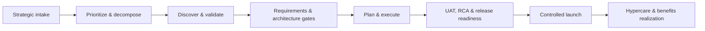
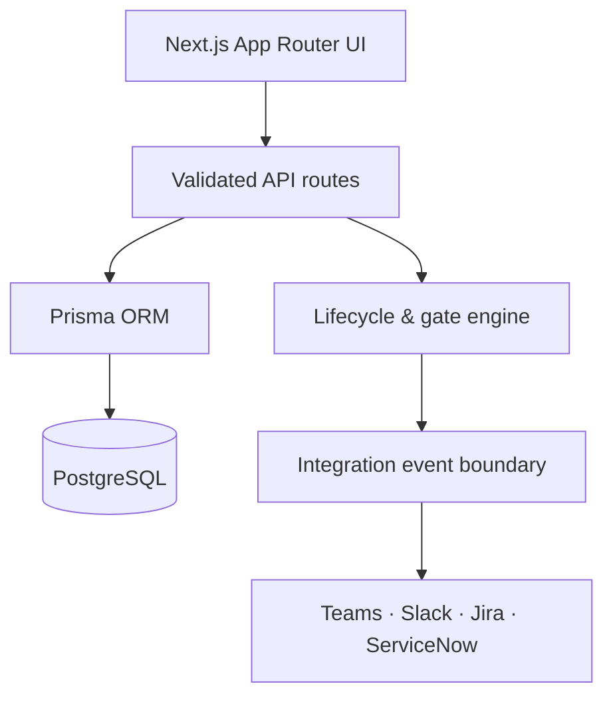

# TARMAC

### Enterprise IT Delivery Control Plane

> **Plan with precision. Launch with confidence.**

[](https://nextjs.org/)
[](https://www.typescriptlang.org/)
[](https://www.prisma.io/)

TARMAC is a portfolio-grade internal platform for managing the complete enterprise software-delivery lifecycle: strategic intake, prioritization, cross-track planning, gated approvals, quality controls, controlled launch, and benefits realization.

**TARMAC** stands for **Technology Alignment, Readiness, Milestones, Assurance & Control**. Like an airport tarmac, it is the operating surface where complex movements are coordinated and cleared before a confident launch.

## Why TARMAC

Enterprise delivery rarely fails because a team cannot write software. It fails at the seams: strategy is disconnected from scope, dependencies are invisible, release evidence is scattered, and critical risks are discovered too late.

TARMAC brings those seams into one control plane. It gives leaders a clear view of the portfolio and gives delivery teams an evidence-based path from intent to outcome.



## Product capabilities

| Area | What TARMAC controls |
| --- | --- |
| **Portfolio intelligence** | Stack Rank Index, blast radius, financial health, EVM indicators, and capacity signals. |
| **Lifecycle governance** | Explicit state transitions, role-based approvals, exception handling, and auditable release gates. |
| **Cross-track delivery** | Dependencies, critical paths, milestones, capacity allocations, and change baselines. |
| **Quality assurance** | Test outcomes, defect severity/SLA management, automated RCA requirements, and launch blocking. |
| **Outcome management** | 30/60/90-day benefit realization against agreed intake KPIs. |

## Architecture

TARMAC is built as a modular Next.js application backed by PostgreSQL and Prisma. Input boundaries use Zod validation; the lifecycle engine protects state changes with explicit gate rules.



Read the [architecture guide](docs/architecture.md) for the domain model, control approach, and planned integration boundaries.

## Technology

- Next.js App Router, React, TypeScript, and Tailwind CSS
- PostgreSQL with Prisma ORM
- Zod validation and a typed lifecycle state machine
- GitHub Actions CI and Dependabot dependency monitoring

## Local development

### Prerequisites

- Node.js 22+
- PostgreSQL 16+ (or a managed PostgreSQL provider)

### Start the application

```bash
git clone https://github.com/PlainJane20/tarmac.git
cd tarmac
npm ci
cp .env.example .env
# Set DATABASE_URL in .env
npx prisma generate
npx prisma migrate dev
npm run dev
```

Open [http://localhost:3000](http://localhost:3000) for the Command Center. The RCA triage experience is available at `/triage`.

## Current delivery status

The current release is a polished prototype with a complete lifecycle domain model, strict launch-gate validation, and interactive command-center and RCA triage experiences. Persistent PostgreSQL-backed workflows, identity integration, and external delivery-tool synchronizers are the next delivery milestones.

See the [roadmap](docs/roadmap.md) for the planned progression from prototype to deployable enterprise demonstration.

## Engineering standards

- TypeScript strict mode and validated request boundaries
- Database schema validation in CI
- Secrets, local datasets, dependencies, and generated build output excluded from Git
- Clear issue, pull-request, security, and contribution standards

See [CONTRIBUTING.md](CONTRIBUTING.md) and [SECURITY.md](SECURITY.md).

## Portfolio note

TARMAC is a personal portfolio project created to demonstrate enterprise architecture, full-stack product engineering, workflow automation, and IT portfolio governance design. It is not an affiliated product or production service.

© 2026 Navi Sohi. All rights reserved.
