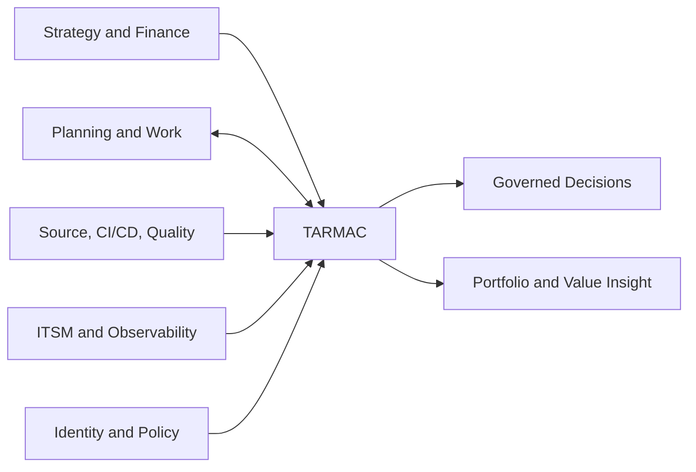
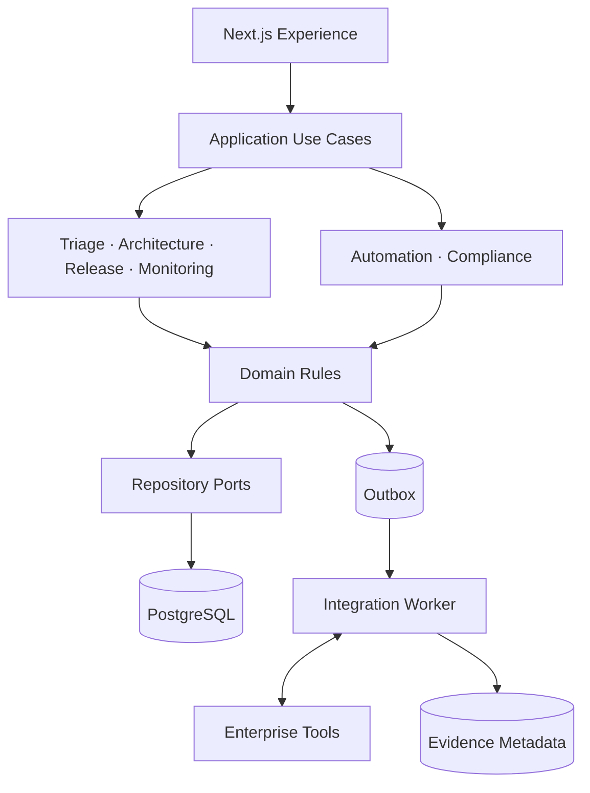

# TARMAC architecture catalog

TARMAC uses a control-plane architecture to connect enterprise delivery decisions without replacing authoritative systems of work.

## Explore

- [Diagram gallery](diagrams.md)
- [Integration architecture](integration-map.md)
- [Architecture Decision Records](adr/README.md)
- [Enterprise architecture brief](../flight-deck/06-enterprise-architecture.md)
- [Governance and compliance](../flight-deck/07-governance-and-compliance.md)

## Enterprise context

## Container view

## Dependency rule

Dependencies point inward. Experiences depend on application use cases; use cases depend on domain rules and ports; infrastructure and vendor adapters implement ports. UI frameworks and vendor SDKs do not enter domain policy.

## Reliability model

Lifecycle changes and audit events are transactional. Integration publication uses a durable outbox. Consumers are idempotent. Remote evidence includes provenance and freshness. A connector outage can age or block evidence; it cannot fabricate readiness.

## Architecture decisions

Create an ADR for changes affecting the TARMAC operating model, trust boundaries, domain ownership, public contracts, persistence, deployment topology, policy evaluation, or material technology direction. Start with the [ADR template](adr/0000-template.md).
