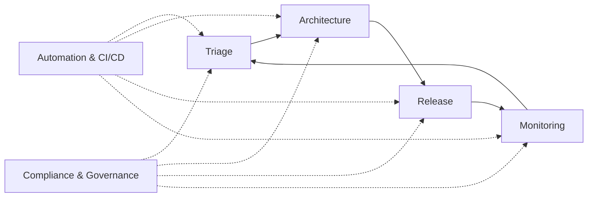
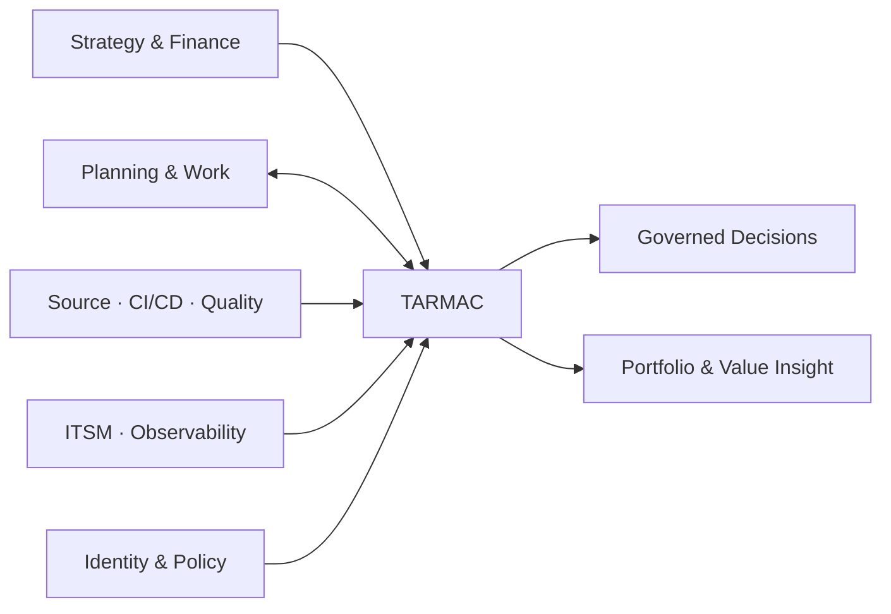
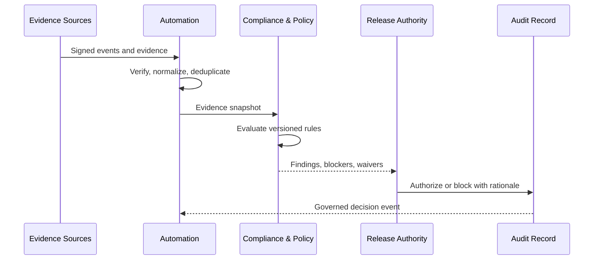
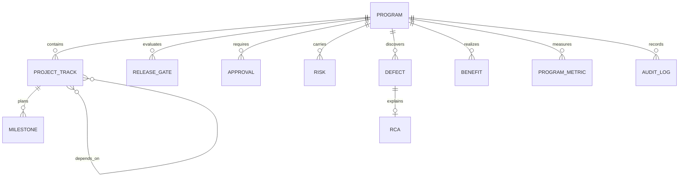

# Architecture and flowchart gallery

The Mermaid diagrams remain diff-friendly and render directly in GitHub. SVG exports provide stable artifacts for presentations, documentation, and offline review.

## TARMAC operating model

[Open the SVG version](svg/tarmac-operating-model.svg)

## Enterprise context

[Open the SVG version](svg/enterprise-context.svg)

## Governed release decision

[Open the SVG version](svg/governed-release.svg)

## Domain relationships

The current Prisma model uses `Program`; the public product language may evolve toward `Initiative` through an explicit migration decision.
