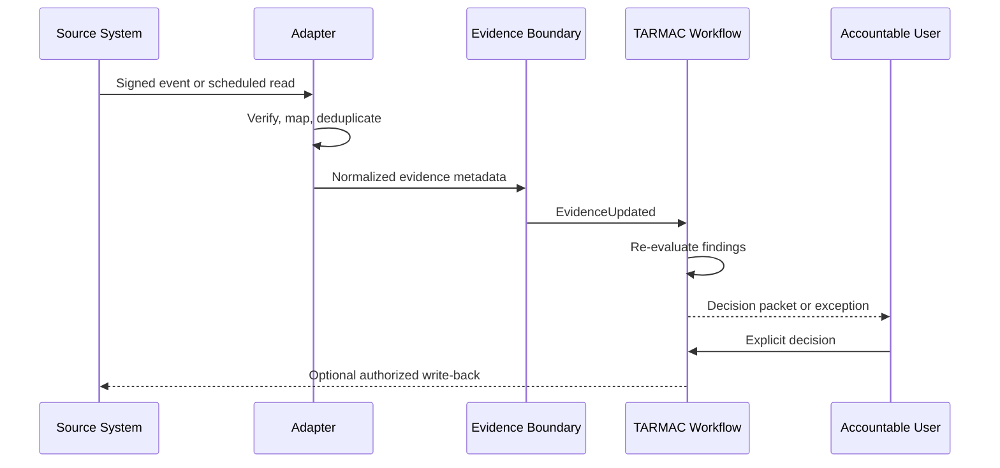

# Integration architecture

## Principles

1. Read only the minimum data required for an explicit decision workflow.
2. Preserve source identity, native record, version, timestamp, and freshness.
3. Use scoped service identities and managed secret references.
4. Verify, normalize, and deduplicate before policy evaluation.
5. Reconcile missed events; never assume webhook delivery is complete.
6. Make write-back actions explicit, authorized, idempotent, and auditable.

## Planned boundaries

| Boundary | Examples | Read | Optional write-back |
| --- | --- | --- | --- |
| Planning/work | Jira, Azure DevOps | epics, milestones, dependencies | decision link/status |
| Source/CI/CD | GitHub, GitLab, pipelines | commits, reviews, builds, deployments | check/status |
| Service management | ServiceNow | changes, incidents, problems | evidence link |
| Quality/security | test, SAST, DAST, SCA | results and findings | none initially |
| Observability | monitoring platforms | SLOs, alerts, release health | annotation |
| Collaboration | Teams, Slack, email | explicit interactions | request/notification |
| Finance/analytics | ERP, planning, warehouse | approved budget and actuals | none |

## Evidence flow

## Failure behavior

Connector health and evidence freshness are visible. Repeated delivery is safe. Mapping failures enter review. Expired evidence cannot silently satisfy a control. A write-back failure does not erase an authoritative TARMAC decision; it remains pending and reconciles later.
