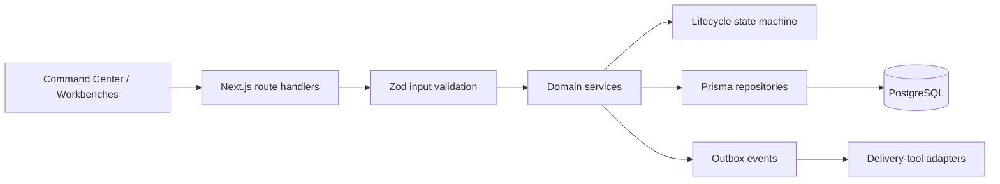

# Architecture

TARMAC is designed as an enterprise delivery control plane. Its boundaries keep portfolio management, lifecycle control, persistence, and integrations independently evolvable.

## Core design decisions

### Explicit lifecycle controls

Program status does not change through a generic update. The lifecycle service permits only sequential transitions and evaluates the relevant controls for the target stage. A program cannot enter `LAUNCH_READY` with an open SEV1/SEV2 defect or an unapproved RCA.

### Audit-ready data model

The Prisma model includes approvals, release gates, baselines, changes, risks, defects, RCAs, program metrics, benefits, and immutable audit events. This provides the foundations for both governance reporting and delivery traceability.

### Deterministic scoring

The Stack Rank Index combines business impact, blast radius, strategic return, effort, and confidence. The denominator is bounded to prevent an invalid zero-effort score.

### Integration boundary

External systems should not change portfolio state directly. Adapter services create durable, idempotent events; domain services evaluate those events against TARMAC controls. This design allows future Slack, Teams, Jira, Azure DevOps, ServiceNow, test-suite, and observability adapters without coupling those systems to the UI.

## Security posture for the demonstration

The current prototype validates API inputs and excludes secrets from source control. A production implementation should add enterprise SSO, role and program-scoped authorization, audit-log retention, encryption, rate limits, structured observability, and formal privacy/data-retention controls.
