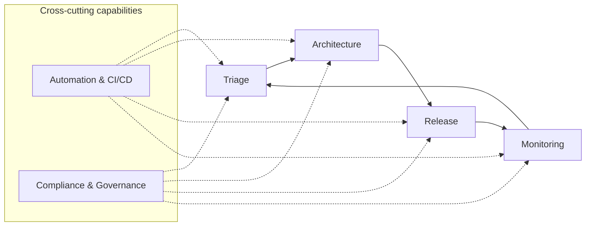

# 03 — Operating model

## Model overview

TARMAC is a continuous operating loop with four delivery pillars and two cross-cutting capabilities.

## Pillar contracts

| Pillar | Entry | Core decision | Exit evidence | Feedback |
| --- | --- | --- | --- | --- |
| Triage | demand or monitoring signal | accept, defer, decline, or investigate | outcome premise, owner, initial priority/risk, baseline plan | reason and next review |
| Architecture | accepted demand | approve, revise, or reject solution direction | decision records, control plan, requirements, NFRs, dependencies | architecture constraints |
| Release | completed change candidate | authorize, block, or waive with risk | test, security, operations, change, support, approvals | release conditions |
| Monitoring | production change/service | stabilize, intervene, continue, or close | service health, incidents, adoption, outcomes, benefit actuals | new triage inputs |

## Automation contract

Automation may gather and normalize evidence, evaluate deterministic rules, identify missing conditions, route decisions, enforce workflow, notify owners, and reconcile system state. It cannot fabricate evidence, hide connector failure, or make accountable risk decisions without explicit authorization.

## Compliance contract

Compliance and governance define which policies apply, who may decide, what evidence is acceptable, how separation of duties works, how exceptions expire, and how decisions are retained. A waiver records accepted risk; it does not convert a failed control into a pass.

## Operating cadence

| Cadence | Forum | Primary output |
| --- | --- | --- |
| Continuous | Triage and evidence events | routing, completeness, exception, and SLA updates |
| Weekly | Portfolio flow review | aging, blockers, dependencies, capacity interventions |
| Biweekly | Architecture/control review | decision packets, findings, and exceptions |
| Release event | Readiness review | explicit authorization and retained evidence snapshot |
| Monthly | Investment and value review | forecast, production feedback, benefit variance, reallocation |
| 30/60/90 days | Outcome review | observed actuals, corrective action, or benefit closure |

## Decision SLA

A decision SLA measures working time from an evidence-complete request to an accountable response. Paused time requires a reason code. The measure exposes system constraints; it is not a quota used to punish reviewers for incomplete submissions.

## Exception policy

Every exception names an owner, scope, rationale, compensating control, approval authority, creation date, expiry, and review trigger. Expired exceptions block dependent governed transitions until renewed or resolved.
