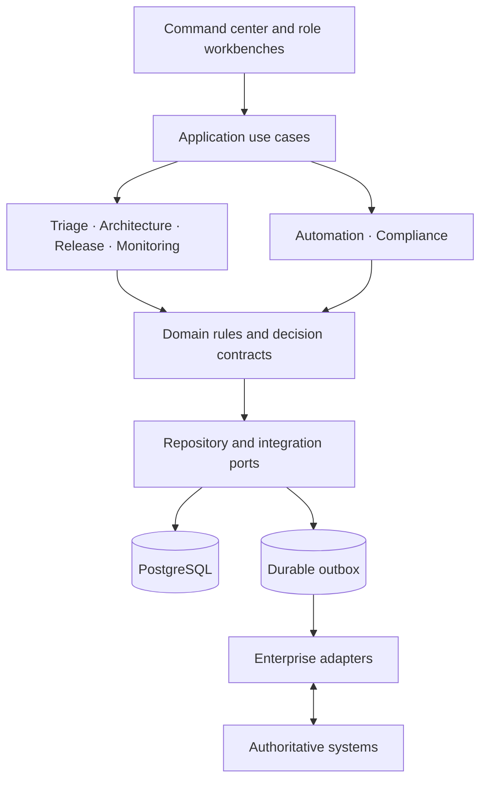

# 06 — Enterprise architecture

The [architecture catalog](../architecture/README.md) contains the system views, diagram sources, and Architecture Decision Records summarized here.

## Architectural intent

TARMAC separates six concerns that mirror its operating model:

1. **Triage services** — intake, scoring, portfolio options, decision SLA.
2. **Architecture services** — requirements, decisions, standards, dependencies, control planning.
3. **Release services** — evidence, gates, approvals, change, quality, readiness.
4. **Monitoring services** — deployments, incidents, SLOs, adoption, benefits, feedback.
5. **Automation services** — workflow, rules, events, adapters, reconciliation, notifications.
6. **Governance services** — identity, authorization, policy, risk, waiver, audit, retention.

## Logical view

## Current implementation

The reference application is a modular Next.js deployment using App Router views and API routes, Zod input validation, explicit TypeScript lifecycle rules, and a Prisma/PostgreSQL model. It demonstrates boundaries without claiming production decomposition or reliability.

## Evolution rule

Remain a modular monolith until an independently owned, independently scaled, or independently governed boundary is proven. Extracting services prematurely would add deployment and operational complexity without validating product fit.

## Architectural invariants

- External tools cannot directly advance governed lifecycle state.
- A lifecycle transition is a command, not a generic record update.
- Material transitions write state and audit evidence atomically.
- Connector failure and evidence staleness remain visible.
- Scores retain method version, inputs, timestamp, and confidence.
- AI output cannot approve, waive, or conceal a control.
- Vendor SDKs and UI frameworks do not enter domain rules.

## Integration boundary

Adapters verify, normalize, deduplicate, and reconcile evidence from authoritative sources. TARMAC owns normalized evidence references and cross-system decisions; sources retain native work items, code, builds, deployments, incidents, and financial actuals.
