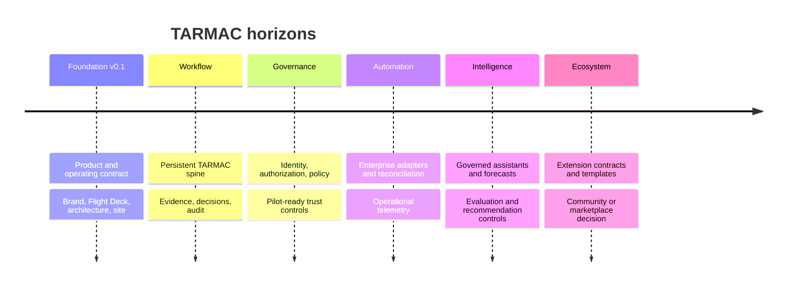

# 09 — Product roadmap

The roadmap is sequenced by evidence and trust, not feature volume. Dates are planning horizons, not commitments.

## Horizon 1 — Foundation v0.1 “Flight Ready”

**Outcome:** stakeholders share one product, acronym, operating-model, architecture, value, and brand contract.

**Exit evidence:** foundation checks pass; public hypotheses are labeled; licensing remains explicitly unresolved rather than assumed.

## Horizon 2 — Workflow

**Outcome:** a representative initiative moves from Triage through Monitoring with durable state, evidence, decisions, and feedback.

- PostgreSQL migrations and synthetic seed data
- authenticated workbenches for triage, architecture, release, and monitoring
- evidence provenance, decision SLAs, findings, approvals, and exceptions
- transactional audit events and durable outbox

**Exit evidence:** the end-to-end scenario survives restart, retry, concurrent action, and negative control tests.

## Horizon 3 — Governance

**Outcome:** the product is suitable for a controlled, non-production enterprise pilot.

- enterprise identity and scoped authorization
- separation of duties, delegation, break-glass, and policy versioning
- retention, privacy, threat model, accessibility audit, and operational runbooks

**Exit evidence:** independent findings have owners and dispositions; pilot data boundaries are approved.

## Horizon 4 — Automation

**Outcome:** evidence arrives from authoritative tools without silent trust or manual reconstruction.

- planning, source, CI/CD, security, ITSM, and observability adapters
- webhook verification, idempotency, reconciliation, replay, and health
- safe, scoped write-back for explicit actions

**Exit evidence:** connector failure cannot fabricate readiness; recovery and reconciliation are demonstrated.

## Horizon 5 — Intelligence

**Outcome:** governed assistants reduce preparation work while authorized people retain decisions.

- role-specific summary and draft workflows
- citation, policy, privacy, and evaluation controls
- explainable forecast and recommendation experiments

**Exit evidence:** usefulness, unsupported-claim, safety, override, latency, and cost thresholds are published and met.

## Horizon 6 — Ecosystem

**Outcome:** validated extension contracts support reusable workflows and integrations.

An open-source license, external contribution model, plugin SDK, marketplace, multi-region scale, and autonomous actions remain deferred until ownership, product fit, trust, and operating economics are resolved.
